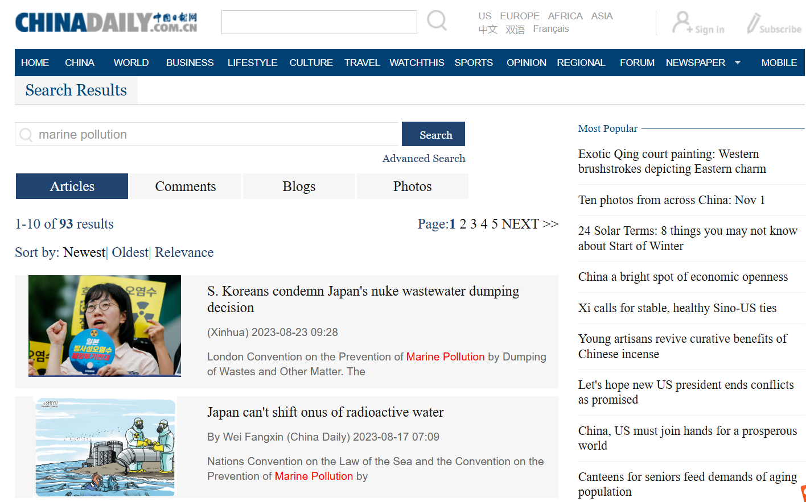
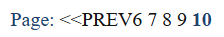
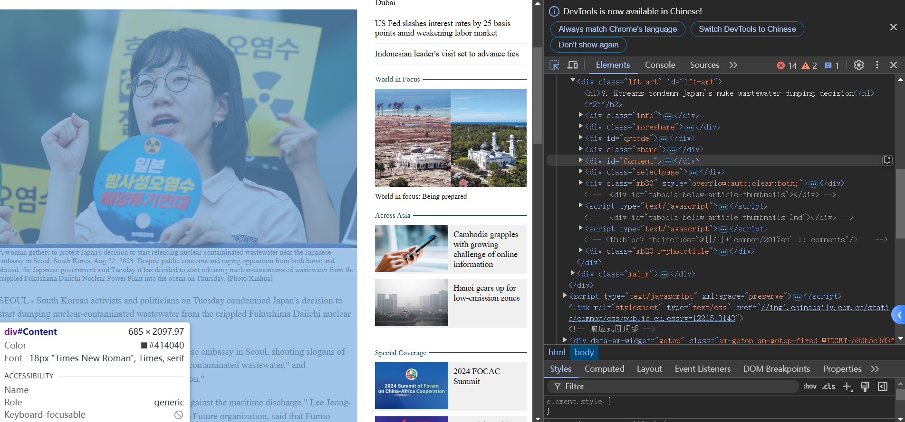
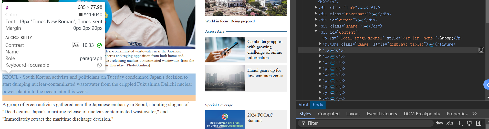
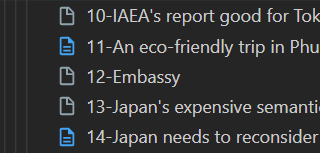

# 使用 Selenium 爬取 ChinaDaily 搜索结果

搜索网页：

CDMPC 2022-2023：

[https://newssearch.chinadaily.com.cn/en/search?cond=%7B%22publishedDateFrom%22%3A%222022-08-24%22%2C%22publishedDateTo%22%3A%222023-08-23%22%2C%22fullMust%22%3A%22marine+pollution%22%2C%22sort%22%3A%22dp%22%2C%22duplication%22%3A%22on%22%7D&language=en](https://newssearch.chinadaily.com.cn/en/search?cond={"publishedDateFrom"%3A"2022-08-24"%2C"publishedDateTo"%3A"2023-08-23"%2C"fullMust"%3A"marine+pollution"%2C"sort"%3A"dp"%2C"duplication"%3A"on"}&language=en)

CDMPC 2023-2024： [https://newssearch.chinadaily.com.cn/en/search?cond=%7B%22publishedDateFrom%22%3A%222023-08-24%22%2C%22publishedDateTo%22%3A%222024-08-23%22%2C%22fullMust%22%3A%22marine+pollution%22%2C%22sort%22%3A%22dp%22%2C%22duplication%22%3A%22on%22%7D&language=en](https://newssearch.chinadaily.com.cn/en/search?cond={"publishedDateFrom"%3A"2023-08-24"%2C"publishedDateTo"%3A"2024-08-23"%2C"fullMust"%3A"marine+pollution"%2C"sort"%3A"dp"%2C"duplication"%3A"on"}&language=en)

## 1. 任务流程

自行进行详细搜索后复制网址并进行爬取，为了获取全文内容，需要从左侧列表里获取标题，并通过超链接进入网络页面，然后再爬取文章内容。



因为直接用 BeautifulSoup4 或者 Scrapy 进行爬取，在不设置 cookie 的情况下会因为反爬虫机制无法获取文章具体信息（被CHINADAILY 隐藏）。使用 selenium 爬取，需要先下载一个针对浏览器的 driver，因为我使用的是火狐（Mozilla 133.0.3, 据说比较方便），所以在geckodriver ([仓库地址](https://github.com/mozilla/geckodriver)) 直接下载了火狐的驱动器，解压后放到运行目录底下。

```python
from selenium import webdriver
import pandas as pd
import os
import time

if __name__ == "__main__":
    # firefox driver
    ff_driver = webdriver.Firefox()
    # 获取文章信息，这部分代码先省略

    # 关闭浏览器
    ff_driver.quit()
```


## 2. 爬取文章标题列表

### 2.1. 获取当前静态页面的文章列表

在总览页面下，文章标题列表被保存在一个 `body > div.main > div.main_l > div.cs_result > div.lft_art`中，每个文章通过一个 `<div>` 类进行封装，里面包括图像（`<a class="art_pic"`）、文章信息（`<span class="intro">` ），链接包括在里面的`<a>` 类中，通过调用`href` 属性获得。

```html
<div class="art_detail">
	<a class="art_pic" href="https://www.chinadaily.com.cn/a/202308/23/WS64e55928a31035260b81db2f.html" target="_blank">...</a>
    <span class="intro">
        <h4>
            <a href="https://www.chinadaily.com.cn/a/202308/23/WS64e55928a31035260b81db2f.html" target="_blank">S. Koreans condemn Japan's nuke wastewater dumping decision
            </a>
        </h4>
        <b>  (Xinhua) 2023-08-23 09:28</b>
        <b style="margin-bottom:2px"> London Convention on the Prevention of 
            <em>Marine</em> 
            <em>Pollution</em> by Dumping of Wastes and Other Matter. The
        </b>
    </span>
</div>
```

为了方便处理，通过 `css selector` 获取链接，保存到一个字典列表，每个元素是一个 `{标题: 链接}` 的字典。

```python
def get_art_urls(driver, urls):
    articles = driver.find_elements("css selector", "span.intro")
    # print(len(results))
    # print(len(results))
    for r in articles:
        # 每个 span 类
        art = r.find_element("css selector", 'a')
        # 标题
        print(art.text)
        print(art.get_attribute("href"))
        article = {
            'title': art.text,
            'href': art.get_attribute('href')
        }
        # art.text = art.get_attribute("href")
        urls.append(article)
    return urls
```


### 2.2. 翻页

在CHINADAILY 的搜索页面提供了翻页按键实现翻页，封装在左边的列表框的右上方，如下图所示。在开头和结尾的时候都会在相应的端口去掉 << PREVIOUS 和 NEXT>> 按钮，但是在当前任务的翻页过程中，只需要 NEXT >> 按钮。




```html
<div class="page rt">
    <span>Page:
        <b>1</b>&nbsp;
        <a href="javascript:void(0);" onclick="$SearchController.pagging(1)" title="page 2">2</a>&nbsp;
        <a href="javascript:void(0);" onclick="$SearchController.pagging(2)" title="page 2">3</a>&nbsp;
        <a href="javascript:void(0);" onclick="$SearchController.pagging(3)" title="page 2">4</a>&nbsp;
        <a href="javascript:void(0);" onclick="$SearchController.pagging(4)" title="page 2">5</a>&nbsp;
        <a href="javascript:void(0);" onclick="$SearchController.pagging(1)" title="next">NEXT &gt;&gt;</a>
    </span>
</div>
```

将尾页鉴定和翻页操作分开到两个函数中，以便处理当前页面的信息。在翻页的时候，如果页面栏中不存在 NEXT >> 之后，返回一个空值一表示到尾页。翻页后给定时间以便处理。

```python
###### Part 2: Page down
def current_pages(driver):
    # 上下都有一个换页栏，选择一个
    page_block = driver.find_element("css selector", "div.page.rt")
    pages = page_block.find_element("css selector", "span")

    # 翻页，如果没有 NEXT 就不翻页了
    if "NEXT" not in pages.text:
        return None
    else:
        return pages

def next_page(driver, pages):
    page_bottons = pages.find_elements("css selector", "a")
    for a in page_bottons:
        # print(a.text)
        if "NEXT" in a.text:
            print("Go to the next page.")
            driver.get(a.get_attribute("href"))
            # actions.click(a)
            a.click()
            driver.implicitly_wait(10)
            import time
            time.sleep(5)
            break
```


### 2.3. 从搜索结果中获取对应的所有文章

```python
def get_articles_from(driver, url):
    driver.get(url)
    driver.implicitly_wait(10)
    # store urls
    urls = []
    # 获取页面信息
    pages = current_pages(ff_driver)
    while True:
        # 获取当前页面的所有文章链接
        urls = get_art_urls(ff_driver, urls)
        # 提取完最后一页需要跳出
        if not pages:
            break
        # 翻页并重新获取页面信息
        next_page(ff_driver, pages)
        pages = current_pages(ff_driver)
    return urls
```

之后在主函数中将文章链接存在对应的 csv 文件中。


## 3. 获取文章具体内容

### 3.1. 获取单一网页下的文章内容

以第一篇文章为例，如果我们直接输出 `<div class="Content">` 的文本，则会将图像标题包括在里面。



为了解决这个问题，使用`xpath` 选择这个板块下的`<p>`类，这是每个自然段分开的。



之后再将所有内容拼接起来即可。

```python
def article_content(driver, url, title, folder, idx):
    driver.get(url)
    driver.implicitly_wait(20)
    # 去除一些“声明”
    def is_normal(t):
        if "necessarily reflect those of China Daily." in t \
            or "send us your writings" in t:
            print(f"Anouncement in ", url)
            return False
        else:
            return True
    # 获取段落，在 content.p 里面
    texts = driver.find_elements("xpath", "//*[@id='Content']/p")
    # 拼接段落并输出
    text = "\n".join([t.text for t in texts if is_normal(t.text)])
    # 添加标题
    text = "\n".join([f"Title: {title}", text])
    # 替换冒号为连接号
    title = title.replace(":", "-")
    output_file = os.path.join(folder, str(idx + 1)+ "-" + title + ".txt")
    with open(output_file, mode='w', encoding='utf-8') as txtfile:
        txtfile.write(text)
    return text
```


### 3.2. 通过遍历获取全年的相关文献

首先从上一章中保存的文件读取每个年份的列表，逐个超链接打开，然后再调用`article_content`函数即可。这里为了防止加载不成功还设置了一个循环用于打不开时刷新页面。

```python
def extract_by_year(driver, df, tgt_path, together_path):
    cnt = 1
    for idx, art in df.iterrows():
        with open(together_path, mode='a', encoding='utf-8') as txtfile:
            for t in range(retry_times):
                try:
                    content = article_content(ff_driver, art["href"], art["title"], tgt_path, idx)
                    break
                except:
                    print(f"Time out, retrying time {t+1}.")
                    time.sleep(1)
    
            txtfile.write(str(idx + 1).center(4, " ").center(40, "#") + "\n" + content + '\n')      
        time.sleep(2)
```


### 3.3. 具体问题解决

发现内容截断（得到空文件），主要是因为在部分标题中会有`:` 存在，在代码中将其替换成`-`解决。



对部分“声明“进行了筛选。

```python
    def is_normal(t):
        if "necessarily reflect those of China Daily." in t \
            or "send us your writings" in t:
            print(f"Anouncement in ", url)
            return False
        else:
            return True
```

还有一个问题就是部分的文章是分页式的结构，这个时候就需要获取这个分页代码然后分页读取。在这里是在文章中设置了一个分页按钮，长这样。


实际上是因为属于习总书记的讲话、活动一类要闻都进行了分页。根据标题把 “Xi” 提取出来之后进行又出现报错，修改代码逻辑，如果遇到报错则返回用单页的处理方式。具体代码如下：

```python
def article_content(driver, url, title, folder, idx):
    # ...
   	# 习总书记相关
    if "Xi" in title:
        try:
            page_block = driver.find_element(By.XPATH, "//*[@id='div_currpage']")
            page_buttons = page_block.find_elements(By.CSS_SELECTOR, "a")
            text = ""
            # 添加标题
            while True:
                # 获取段落，在 content.p 里面
                texts = driver.find_elements("xpath", "//*[@id='Content']/p")
                # 拼接段落并输出
                text += "\n".join([t.text for t in texts])
                # 不是最后一页
                if "next" in page_block.text.lower():
                    for b in page_buttons:
                        try:
                            if b.text.lower() == "next":
                                # 点击 Next 按钮
                                b.click()
                                print("Next page clicked")

                                # 等待页面加载并重新获取新的 URL
                                WebDriverWait(driver, 10).until(
                                    EC.staleness_of(page_block)  # 等待当前页面的元素不再可用
                                )
                                
                                # 在此时尝试获取新的 URL
                                current_url = driver.current_url
                                print(f"New page URL: {current_url}")

                                # 确保页面已经完全加载，可以在这里使用 driver.get() 强制加载
                                driver.get(current_url)
                                
                                # 等待新页面加载完成
                                WebDriverWait(driver, 10).until(
                                    EC.presence_of_element_located((By.XPATH, "//*[@id='div_currpage']"))
                                )

                                # 重新获取分页块元素
                                page_block = driver.find_element(By.XPATH, "//*[@id='div_currpage']")
                                page_buttons = page_block.find_elements(By.CSS_SELECTOR, "a")
                                break

                        except Exception as err:
                            print(f"Error: {err}")
                            driver.quit()
                            break
                else:
                    break
        except Exception as err:
            print("Error: when extracting in a multi-page manner, exception occured:")
            print(err)
            print("Try to solve it in single-page manner.")
            # 获取段落，在 content.p 里面
            texts = driver.find_elements("xpath", "//*[@id='Content']/p")
            # 拼接段落并输出
            text = "\n".join([t.text for t in texts if is_normal(t.text)])
            # 添加标题
            text = "\n".join([f"Title: {title}", text])
	# .
```


